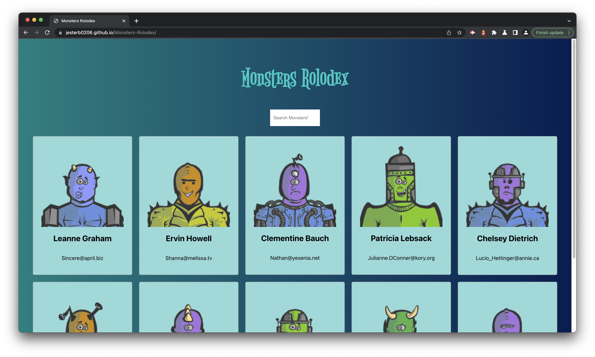

# Monsters Rolodex

 

## License

 

[This application is under the MIT license](https://opensource.org/licenses/MIT)

 

## Deployment Link

 

 

[Deployment](https://jesterb0206.github.io/Monsters-Rolodex/)

 

☝🏻 Click there!

 

## Description

 

**From the Complete React Developer in 2023 (w/ Redux, Hooks, GraphQL) Udemy Course**

 

## Badges

 

 

 

 

 

 

 

 

 

 

## Questions

 

If you have any additional questions, you can reach me at:

 

### GitHub

 

 

[jesterb0206](https://www.github.com/jesterb0206)

 

### Email

 

 

bradleyjester0@gmail.com

 
